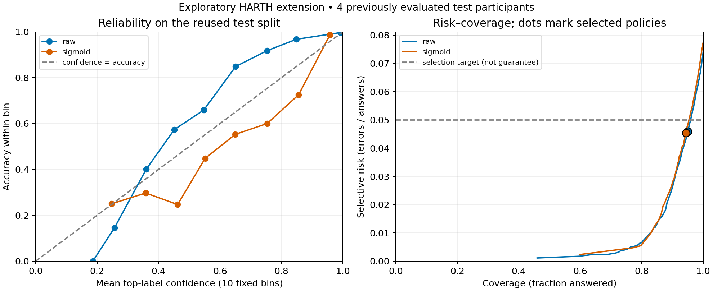

# abstain-har

Human activity recognition with explicit abstention and subject-disjoint evaluation.

**Status: HARTH baseline, calibration, abstention and fixed-model stress experiments are recorded.** There are no deployed endpoints or clinical validation claims.

## When confidence fails under changed inputs

The [fixed stress protocol](docs/ROBUSTNESS.md) evaluates eleven conditions on the same 5,738 test windows, with model artifacts and thresholds frozen before execution. These are **exploratory feature-level simulations on a previously viewed test split**, not measured device failures or independent validation.

| Condition | Raw coverage | Raw errors / answers | Sigmoid coverage | Sigmoid errors / answers |
| --- | ---: | ---: | ---: | ---: |
| Clean control | 95.02% | 4.59% | 94.41% | 4.54% |
| Thigh summaries missing on every window | 0% | Undefined | 0% | Undefined |
| Back summaries all zero | 100% | 93.97% | 100% | 93.97% |
| All summaries scaled by 0.5 | 78.69% | 18.14% | 81.67% | 19.16% |
| Back-x offset +1 g | 89.75% | 92.66% | 88.27% | 91.27% |
| Back/thigh columns exchanged | 81.54% | 78.05% | 81.61% | 76.70% |

Missing inputs are rejected by a finite-value check **before prediction**. This is input validation, not learned abstention. Zero-valued sensor summaries pass that check: 4,857 raw and 4,828 sigmoid clean accepted/correct windows become accepted/wrong. Confidence thresholds alone do not provide protection against these changed inputs.

The full report retains both variants and all conditions, including a small offset where aggregate risk falls but some previously correct answers become wrong. It separates input rejection, model abstention and acceptance; overall coverage includes rejected windows. Per-participant/class counts, paired transitions, errors on the shared accepted subset and participant bootstrap intervals are recorded. Four test participants give limited uncertainty evidence. No model or threshold was retuned after these results.

[All stress results](examples/robustness-v1/REPORT.md) · [Counts and provenance](examples/robustness-v1/report.json)

```bash
.venv/bin/python robustness.py artifacts/harth-input-v1 \
  --models artifacts/selective-v1 --output artifacts/robustness-v1
```

The runner requires the locally generated, hash-matched selective model artifacts and pinned ML environment. Models and feature rows remain excluded from the repository.

## Calibration and abstention

The [fixed extension protocol](docs/ABSTENTION.md) calibrates the selected forest on three separate participants and chooses thresholds on another three. This is **exploratory reuse of the previously evaluated four-person test split**, not a new independent validation sample.

| Variant | Test coverage (answered) | Errors among answers |
| --- | ---: | ---: |
| Raw forest, no abstention | 100% | 7.41% |
| Raw forest, threshold 0.43 | 95.02% | 4.59% |
| Sigmoid, no abstention | 100% | 7.74% |
| Sigmoid, threshold 0.64 | 94.41% | 4.54% |

The empirical threshold-selection target was risk ≤5% with coverage ≥50% and at least 100 answers; it is **not a guarantee**. Three of the four test participants exceed 5% risk under each selected policy. Class 140 remains a failure: raw accepts both of its two test windows incorrectly; sigmoid accepts one incorrectly and abstains on the other.

Calibration did not consistently improve probability quality: log loss increased from 0.2486 to 0.2514 and top-label ECE from 0.0388 to 0.0435, while Brier changed slightly from 0.1097 to 0.1096. Both variants are retained; no winner is selected using test results. Calibration data includes a class with just one window, and the recorded run includes the resulting library warning.



[Generated report](examples/selective-v1/REPORT.md) · [Detailed counts and uncertainty](examples/selective-v1/report.json) · [Run and warning record](examples/selective-v1/run.json)

```bash
.venv/bin/python selective.py artifacts/harth-input-v1 --output artifacts/selective-v1
```

Use the pinned ML environment and a new output directory. Abstained decisions have `label: null`. Input validation, model abstention and clinical safety are distinct questions.

## Baseline results

Three models were compared using 30 features, 12 fitting participants and four held-out test participants (5,738 windows). Settings and the [evaluation protocol](docs/BASELINE.md) were committed before the research model run. Model selection used four-fold participant-separated CV within the fitting set.

| Model | Fit-only CV macro-F1 | Test macro-F1 | Test balanced accuracy | Test accuracy |
| --- | ---: | ---: | ---: | ---: |
| Most-frequent dummy | 0.0439 | 0.0638 | 0.0833 | 0.6199 |
| Standardised logistic regression | 0.5808 | 0.5945 | 0.6654 | 0.8865 |
| Random Forest | 0.5954 | 0.6407 | 0.6381 | 0.9259 |

Random Forest was selected by fit-only CV, but logistic regression has higher test balanced accuracy. Random Forest recall is only 0.3113 for shuffling and 0.3736 for ascending stairs; class 140 has just two test windows and neither is correctly predicted. Accuracy alone hides these limitations. Macro-F1 averages all twelve classes; balanced accuracy averages recall over classes with true support.

See the [generated report](examples/baseline-v1/REPORT.md) for participant variation and [report.json](examples/baseline-v1/report.json) for confusion matrices, class support, participant bootstrap intervals, timings and provenance. Four test people give limited evidence of generalisation. The published baseline is not a fresh holdout for future changes informed by its results.

```bash
python3 -m venv .venv
.venv/bin/python -m pip install -r requirements-ml.txt
# Download and prepare the pinned HARTH archive as documented below.
.venv/bin/python baseline.py artifacts/harth-input-v1 --output artifacts/baseline-v1
```

Use a new output directory. [Full reproduction and metric definitions](docs/BASELINE.md).

## Research question

How does a classifier perform on people it has not seen during training, and how does its error rate change when it can abstain from answering?

The evaluation approach separates participants across model fitting, probability calibration, threshold selection, and final testing. Results should report both the fraction of predictions accepted (coverage) and the error rate among accepted predictions (selective risk), including participant-level variation.

Abstention does not guarantee correctness. A model can be confidently wrong, especially when sensor inputs or populations change. With zero accepted predictions, selective risk is undefined, not zero.

## Try the synthetic input integration

A [versioned integration with Open Care Evidence Toolkit](docs/CARE_INTEGRATION.md) now checks as-of data provenance, input quality decisions, and subject-disjoint input splits:

```bash
python3 prepare_inputs.py examples/integration/bundle.json \
  --splits examples/integration/splits.json --output artifacts/prepared.json
```

The fixed example contains six synthetic samples: four eligible input rows, one quality rejection, and one insufficient-data exclusion. The three-value indicator summaries are not HAR sensor features. No training, prediction, or model abstention takes place.

## Validate the HAR input layout

The [HAR adapter](docs/HAR_INPUT.md) validates 561-feature vectors, aligned activity/subject files, and official train/test subject separation. It plans fit/calibration/threshold roles using training subjects only, without using labels or feature values for assignment.

```bash
python3 scripts/make_synthetic_har.py --output data/synthetic-har
python3 har_input.py data/synthetic-har --dataset-kind synthetic \
  --calibration-subjects 1 --threshold-subjects 1 --output artifacts/har-input
```

The [example report](examples/har-input-v1/REPORT.md) uses generated numbers, not research recordings. Official archive metadata has been inspected, but [conflicting usage descriptions](docs/DATASETS.md#uci-har-distribution-inspection-2026-09-26) remain unresolved. Research matrices have not been loaded or evaluated here.

## Repository contents

The selected research input source is [HARTH's pinned 22-participant UCI distribution](docs/HARTH_PROTOCOL.md). `harth_input.py` streams this archive into participant-separated, non-overlapping windows with 30 named features and an input-quality report. Its source manifest records header exceptions and the fixed split. The separate 561-column adapter is specific to UCI HAR.

The [completed research input run](examples/harth-input-v1/REPORT.md) processed 6,461,328 rows into 25,531 windows. Threshold-selection data lacks class 140; this limitation is recorded without changing the split. These counts are input evidence, not model performance. Raw recordings and derived feature rows are not included.

- [Synthetic integration](docs/CARE_INTEGRATION.md): contract, limitations, and fresh two-repository reproduction.
- `prepare_inputs.py`: checked feature batches and explicit exclusions.
- `tests/`: subject separation, temporal availability, feature consistency, and CLI regression checks.
- `har_input.py`: positional HAR schema validation and reproducible participant split manifests.
- `harth_input.py`: pinned research archive validation and window features.
- `baseline.py`: fit-only grouped model selection, held-out evaluation, and aggregate reports.
- `selective.py`: frozen-base sigmoid calibration, threshold selection and explicit abstention.
- `robustness.py`: fixed-model paired feature perturbations with separate input rejection and model abstention counts.
- [Dataset notes](docs/DATASETS.md): candidate sources, attribution, and compatibility limits.
- `scripts/check_public_repo.py`: public-content checks for staged or tracked files.
- `.github/workflows/public-content.yml`: the same content check in CI.

CI runs synthetic regression tests for input processing, feature exclusion, grouped selection and metrics, plus the integration against a pinned producer revision. It does not download research recordings or run the full benchmark. Passing CI is not evidence of model quality; the recorded research run is separate.

After installing `requirements-ml.txt`, run all local tests with `.venv/bin/python -m unittest discover -s tests -v`. Tests use temporary synthetic files and do not modify research data.

## Local content check

Requires Python 3.11 or newer and Git; no third-party Python packages are required.

```sh
python3 scripts/check_public_repo.py --tracked
```

Before committing:

```sh
python3 scripts/check_public_repo.py --staged
git diff --cached --check
```

The content check is a guard against known patterns, not a complete security or privacy audit. Review every file before publication.

## Scope and limitations

This is a research software project, not a medical device or a clinical decision system. Public research datasets must not be described as synthetic data. Any future synthetic examples must be labelled separately from predictions derived from research recordings.

Do not contribute private health records, identifiable personal information, credentials, or course assignment materials. Dataset licenses remain separate from this repository; raw datasets and trained models are not included.
